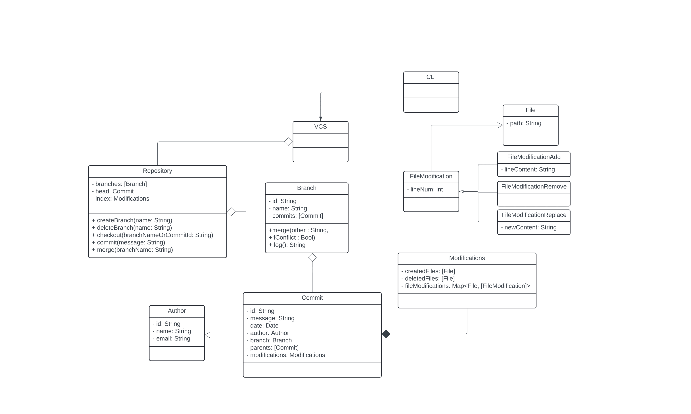
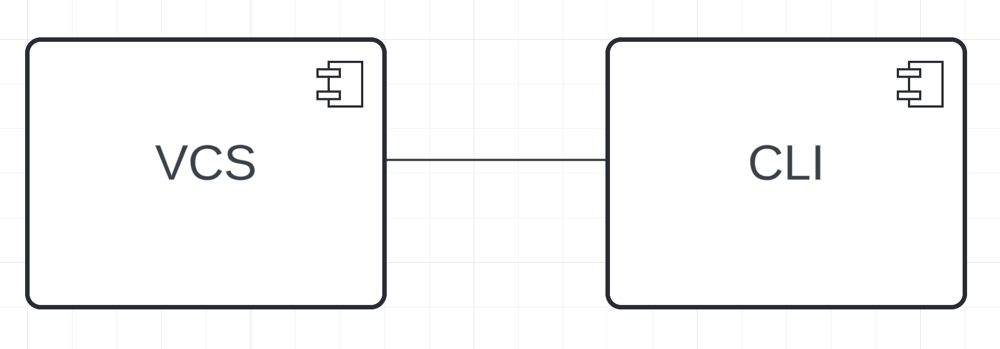

# software-design-course

#### Команда №1 (MSE'23)
- Георгий Семенов
- Максим Васильев
- Дмитрий Патока

## Задачи

[Задание №1. Задача про CLI](./hw1-cli/)

[Задание №2. Задача про Bash #1](./hw2-bash1/)

[Задание №3. Задача про Bash #2](./hw3-bash2/)

Задание №4. Задача про Bash #3 - добавить grep (без отдельной страницы)

Задание №5. Задача про Bash #4 - см. [наш пулл-реквест к другой команде](https://github.com/HaskSy/oh-my-gosh/pull/5)

Задача №3-5. Диаграммы -> см. [class3.png, (usecase, activity, bpmn) за 4-ую, (microwave state, sequence, TODO TIME )](https://github.com/gvsem/software-design-course/tree/hw5/class-work)

Задания №6-10. Рогалик -> см. [отдельную доку](./roguelike/)

Задача №9. Git TODO

Диаграмма классов:

Диаграмма компонентов:

#### Ответы на вопросы:

▶ **Как представляются файлы, коммиты, ветки, репозиторий?**

Файлы представляются как пути до них. Коммиты, ветки и репозиторий инкапуслируются соответствующими классами.

▶ **Как выполняется компрессия и выполняется ли вообще?**

Мы храним только диффы и последнюю версию файла.

▶ **Насколько просто получить текущую, предыдущую, произвольную версии?**

Текущую и предыдущую - за O(1) отката изменений. Произволюную - за O(n) откатов, где n - длина ветки.

▶ **Каков жизненный цикл файла?**

Мы отслеживаем файл только в том случае, если он есть в соответствующей мапе Branch.

▶ **Как выполняется работа с файловой системой?**

Мы серриализуем и десереализуем классы, инкапусируюущие логику работы системы контроля версий.

▶ **Как выполняется работа с пользователем? Как представляются команды?**

Команды представляются в виде названия команды и ее аргументов. Каждой команде сответствует отдельный класс, являющийся наледником абстрактного класса Command (аналогично тому, что было в Bash).

Задача №10. DDD TODO
