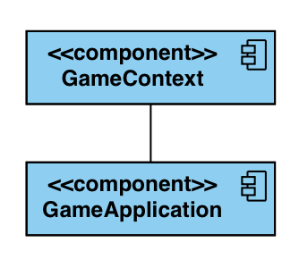
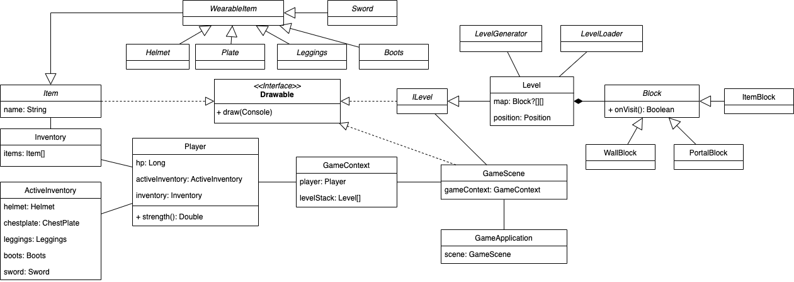
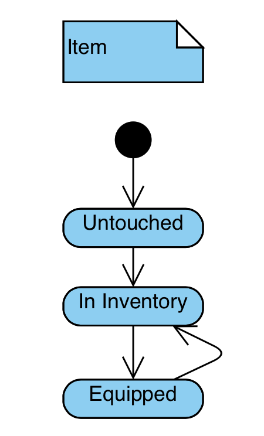
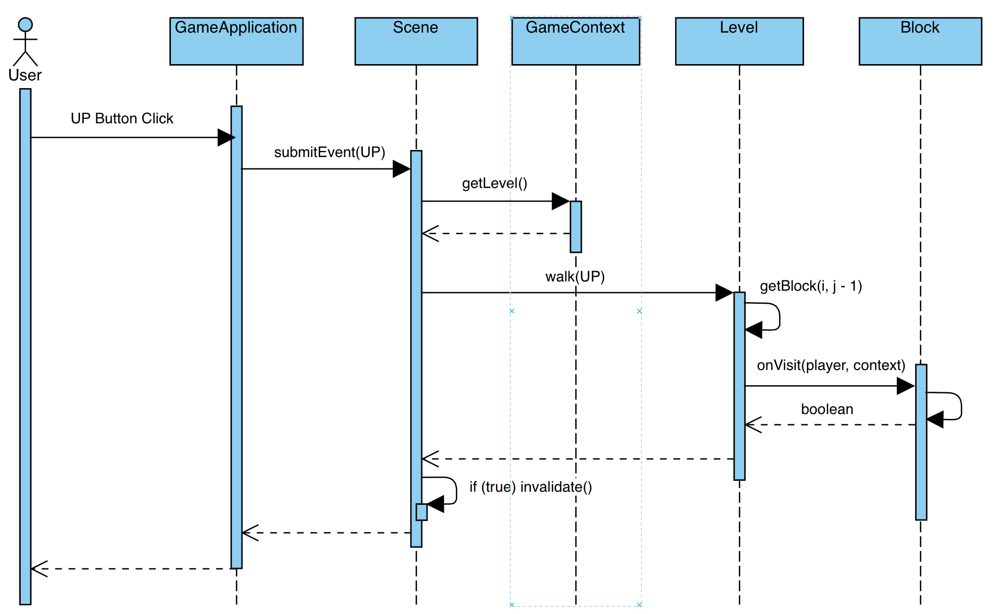

## Roguelike

## Требования к игре

- Игрок перемещается по карте
    - Стрелочки перемещают игрока по карте
- Карта генерируется, а также подгружается из файла
- Характеристики игрока:
    - здоровье ❤️ - int от 0 до 10, 
    - сила атаки 🔱 - double от 1.0 до inf и т.д.
    - степень бронированности ♐️ - double от 0 до 10 с шагом 0.5
- У игрока есть инвентарь с вещами:
    - можно надеть и снять вещи
        - просматривать надетые вещи (Шлем ``^^`` | Нагрудник ``[]`` | Штаны ``/\`` | Ботинки ``db``) и оружие (🗡) в инвентаре внизу
        - просматривать список всех вещей в инвентаре внизу
        - выбирать вещи в инвентаре с помощью [AD] и надевать с помощью [E]
        - снимать надетые вещи с помощью [1-5]
    - надетые вещи влияют на характеристики игрока
    - вещи изначально находятся на карте, их можно поднять и добавить в инвентарь
    - снятые вещи продолжают находиться в инвентаре
- Игровой мир состоит из уровней
    - Навигация по уровням происходит вложенным образом
    - Одновременно может существовать не более одного экземпляра уровня
    - Если происходит перемещение в еще непосещенный уровень, он создается впервые
    - Если происходит перемещение в уже посещенный уровень, то происходит уничтожение всей промежуточной последовательности уровней (модель стека)

- Консольная графика

## Общие сведения о системе

Игра представляет консольное приложение на Java, размером консоли 80x24 с управлением с помощью стрелочек и ENTER.

## Architectural drivers

#### Архитектурный стиль

Scene – класс, ответственность которого в отрисовке игрового интерфейса. Он связан с GameContext и знает полностью всю игровую информацию. У него есть метод invalidate(), а также есть метод draw().

GameApplication - класс, который принимает пользовательские события (стрелочки, [AD], [E], [1-5], [ENTER]) и передает в Scene. А также, если Scene инвалидирована, переотрисывает ее в консоли с помощью метода draw().

#### О паттернах проектирования

- Для создания различных вещей будет использована ``фабрика``
- Блок с вещью будет ``декоратором`` над вещью
- Генератор уровня будет конструироваться с помощью паттерна ``строитель``
- Игровой контекст реализует паттерн ``медиатор``

## Роли и случаи использования

Игрок ходит по карте, соответствующей блокам:
- стена (пройти нельзя)
- предмет (он подбирается)
- пустой блок (можно тривиально по нему ходить)
- портал 🚪 (перемещает на следующий уровень)
- кактус 🌵 (отнимает здоровье)

У игрока есть следующие свойства:
- здоровье ❤️ - int от 0 до 10 (влияет в мини-играх и пр.)
- степень бронированности ♐️ - int от 0 до 10 с шагом 0.5 (влияет в мини-играх)
- опыт 🕶 - double от 0 до inf (влияет на игровые цели и пр.)
- сила 🔱 - double от 1.0 до inf (влияет в мини-играх и пр.)

Предметы бывают следующих типов:
- хилер ❤️ (восстанавливает одно сердечко)
- броня: шлем, нагрудник, штаны, ботинки
- меч

Броня, когда надета, увеличивает степень бронированности на константу Меч, когда экипирован, увеличивает силу на константу. Хилер, когда его подбираешь на карте, увеличивает здоровье на сердечко.

Когда здоровье заканчивается, игрок умирает, игра заканчивается.

## Композиция

Диаграмма компонентов

## Логическая структура

Диаграмма классов

## Взаимодействия и состояния

Диаграммы последовательностей и конечных автоматов

