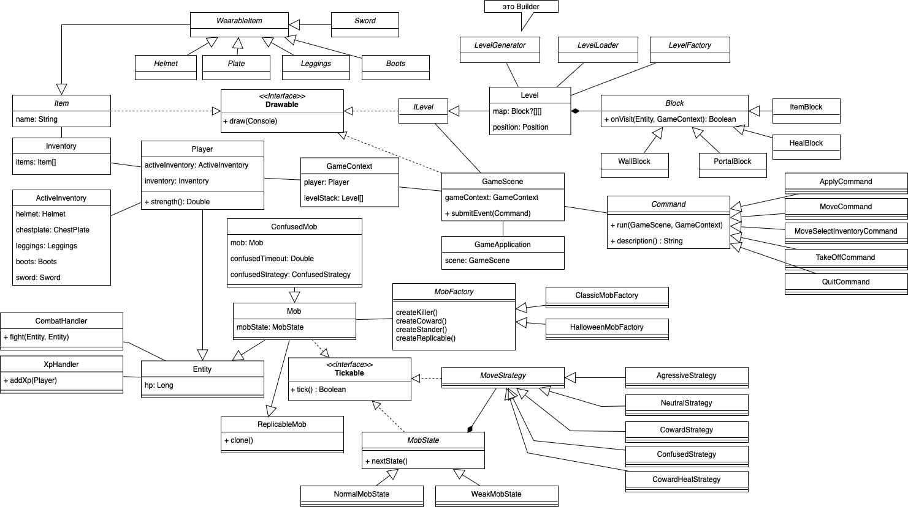

# Roguelike

## Условия заданий

### Hw6

▶ Персонаж игрока, способный перемещаться по карте, управляемый с клавиатуры
▶ Карта обычно генерируется, но для некоторых уровней грузится из файла
▶ Характеристики — здоровье, сила атаки и т.д.
▶ У персонажа есть инвентарь, состоящий из вещей, которые он носит с собой
▶ Вещи из инвентаря можно надеть и снять, надетые вещи влияют на характеристики персонажа
▶ Вещи изначально находятся на карте, их можно поднять, чтобы добавить в инвентарь
▶ Снятые вещи находятся в инвентаре, их можно надеть в дальнейшем
▶ Консольная графика

Разделиться на команды по два-три человека и написать архитектурное описание Roguelike
▶ Общие сведения о системе
▶ Architectural drivers
▶ Роли и случаи использования
▶ Описание типичного пользователя
▶ Композиция (диаграмма компонентов)
▶ Логическая структура (диаграмма классов)
▶ Взаимодействия и состояния (диаграммы последовательностей и конечных автоматов)

### Hw7

В команде реализовать архитектуру Roguelike из предыдущего задания. При этом:

рекомендуется (хотя и необязательно) использовать какую-либо готовую библиотеку для работы с консолью, но готовые фреймворки для разработки Roguelike-игр нельзя;
есть много туториалов по этому делу, смотреть в них можно, списывать нет;
постарайтесь не терять кроссплатформенности (у ncurses и даже python-библиотек на её основе могут быть проблемы под Windows, например);
как обычно, если что-то выбираете, обоснуйте выбор в архитектурной документации;

нужны юнит-тесты, CI и комментарии ко всему, что public;надо обновить диздок, чтобы привести его в соответствие фактической реализации.
Напомним, что дальше будут появляться новые требования, которые надо будет реализовать в рамках этой кодовой базы.

### Hw8

В команде продолжить работу над Roguelike. В этом задании требуется реализовать поддержку мобов по следующим требованиям:

1)мобов должно быть несколько разных видов, различающихся характеристиками и поведением:
-агрессивное поведение, атакуют игрока, как только его видят;
-пассивное поведение, просто стоят на месте;
-трусливое поведение, стараются держаться на расстоянии от игрока.

2)нужна боевая система, в которой:
-персонажи, пытающиеся занять одну клетку, наносят друг другу урон в соответствии с их параметрами (атаки и защиты, и, возможно, каких-либо ещё);
-урон уменьшает количество хитпойнтов, и если их становится 0 или меньше, персонаж умирает;

3)нужна система экспы и уровней:
-при убийстве моба персонажу игрока начисляется некоторое количество очков опыта;
-при наборе достаточного количества опыта персонаж получает следующий уровень, что приводит к росту его характеристик.

При этом надо использовать паттерны, обсуждавшиеся на теории:
паттерн "Стратегия" для поддержки различных поведений мобов;
используя паттерн "Декоратор", реализовать для игрока возможность конфузить мобов;
-моб, находящийся под эффектом конфузии, перемещается, случайно выбирая соседнюю клетку;
-эффект должен быть временным.

Эту задачу надо реализовывать, отведя новую ветку от предыдущей и, соответственно, открыв новый пуллреквест.
Также надо обновить архитектурную документацию (как диаграмму, так и словесное описание), включив туда описание новой функциональности.

Не забудьте юнит-тесты и комментарии.

### Hw9

Продолжить в команде работу над Roguelike. В этом задании требуется улучшить генерацию карт и поддержку мобов. Разумеется, применяя паттерны с теории.

Паттерн "Строитель" для параметризации генератора карт. Должно быть можно сообщить строителю, грузить карту из файла или сгенерировать, указать желаемые размеры карты, и вызвать метод build(), возвращающий сгенерированную карту.
Паттерн "Абстрактная фабрика" для генерации разных стилей мобов — например, фэнтезийные мобы в духе "скелет", "дракон" и т.д., или научно-фантастические, в духе "киборг-бензопильщик" и т.п. Фабрикой должно быть можно параметризовать строитель из предыдущего пункта.
Паттерн "Прототип" для мобов, реплицирующихся на поле боя — например, "ядовитая плесень", которая каждый ход с вероятностью p порождает свою копию в соседней свободной клетке. Можно игру "Жизнь" реализовать, если хочется :)
Как обычно, задача сдаётся отдельным пуллреквестом от ветки с предыдущей задачей. Стоит также время от времени подмерждивать в неё исправления к предыдущим задачам.

Также надо обновить архитектурную документацию (как диаграмму, так и словесное описание), включив туда описание новой функциональности.

Не забудьте юнит-тесты и комментарии.

### Hw10

Наконец, последняя домашняя работа про Roguelike. В этом задании надо применить поведенческие шаблоны для того, чтобы зарефакторить взаимодействие с пользователем и улучшить ИИ мобов:

Паттерн "Команда" для реализации взаимодействия с пользователем — напрямую обращаться из UI к классам бизнес-логики теперь нельзя, все действия должны выполняться строго через команды. Использовать "умные" или "глупые" команды — на ваше усмотрение.

Паттерн "Состояние" для придания "стратегичности" действиям моба. Напомним, что в одном из предыдущих заданий требовалось реализовать стратегии поведения. Сейчас поведение моба должно определяться его состоянием:
если здоровье моба ниже определённого уровня, он переходит в состояние "паника", в котором его текущая стратегия заменяется на трусливую (если изначально стратегия была трусливой, никаких изменений в поведении моба нет);
при восстановлении здоровья выше этого уровня моб переходит из состояния "паника" в состояние "всё ок", где переключается на исходную стратегию;
до +3 бонусных баллов за реализацию дополнительных стратегий и состояний (например, "патрулирую", "движусь в место последнего контакта с врагом", "выполняю поиск в районе последнего контакта", "атакую").

Как обычно, задача сдаётся отдельным пуллреквестом от ветки с предыдущей задачей.
Также, как обычно, надо обновить архитектурную документацию, включив туда описание новой функциональности.

# Артефакты

## Hw6

### Требования к игре

- Карта представляет собой набор уровней (2d-полей, состоящее из клеток)
- Игрок перемещается по клеткам карты
    - Стрелочки перемещают игрока по карте
    - Специальные блоки - порталы - перемещают игрока между уровнями
- Карта состоит из уровней, корторый случайно генерируется, а также подгружаются из файла
- Характеристики игрока:
    - здоровье ❤️ - int от 0 до 10, 
    - сила атаки 🔱 - double от 1.0 до inf и т.д.
    - степень бронированности ♐️ - double от 0 до 10 с шагом 0.5
- У игрока есть инвентарь с вещами:
    - можно надеть и снять вещи
        - просматривать надетые вещи (Шлем ``^^`` | Нагрудник ``[]`` | Штаны ``/\`` | Ботинки ``db``) и оружие (🗡) в инвентаре внизу
        - просматривать список всех вещей в инвентаре внизу
        - выбирать вещи в инвентаре с помощью [AD] и надевать с помощью [E]
        - снимать надетые вещи с помощью [1-5]
    - надетые вещи влияют на характеристики игрока, отображающиеся в интерфейсе
    - вещи изначально находятся на карте, их можно поднять и добавить в инвентарь
    - снятые вещи продолжают находиться в инвентаре
- Игровой мир состоит из уровней
    - Навигация по уровням происходит вложенным образом
    - Одновременно может существовать не более одного экземпляра уровня
    - Если происходит перемещение в еще непосещенный уровень, он создается впервые
    - Если происходит перемещение в уже посещенный уровень, то происходит уничтожение всей промежуточной последовательности уровней (модель стека)
- Мобы спавнятся на уровне единожды, при попадании игрока на уровень 
  - Мобы могут быть агрессивными, нейтральными и трусливыми
  - Мобов должно быть возможно конфузить - давать им временный эффект случайного блуждания
  - Должна быть механика моба, который размножается экспоненциально
  - При хп меньше 40% мобы пытаются восстановить здоровье, а затем возвращаются к прежней стратегии поведения 
- Консольная графика

## Общие сведения о системе

Игра представляет консольное приложение на Java, размером консоли 80x24 с управлением с помощью стрелочек и ENTER.

## Architectural drivers

#### Архитектурный стиль

Scene – класс, ответственность которого в отрисовке игрового интерфейса. Он связан с GameContext и знает полностью всю игровую информацию. У него есть метод invalidate(), а также есть метод draw().

GameApplication - класс, который принимает пользовательские события (стрелочки, [AD], [E], [1-5], [ENTER]) и передает в Scene. А также, если Scene инвалидирована, переотрисывает ее в консоли с помощью метода draw().

#### О паттернах проектирования

- Для создания различных вещей будет использована ``фабрика``
- Блок с вещью будет ``декоратором`` над вещью
- Генератор уровня будет конструироваться с помощью паттерна ``строитель``
- Игровой контекст реализует паттерн ``медиатор``

## Роли и случаи использования

Игрок ходит по карте, соответствующей блокам:
- стена (пройти нельзя)
- предмет (он подбирается)
- пустой блок (можно тривиально по нему ходить)
- портал 🚪 (перемещает на следующий уровень)
- кактус 🌵 (отнимает здоровье)

У игрока есть следующие свойства:
- здоровье ❤️ - int от 0 до 10 (влияет в мини-играх и пр.)
- степень бронированности ♐️ - int от 0 до 10 с шагом 0.5 (влияет в мини-играх)
- сила 🔱 - double от 1.0 до inf (влияет в мини-играх и пр.)

Предметы бывают следующих типов:
- хилер ❤️ (восстанавливает одно сердечко)
- броня: шлем, нагрудник, штаны, ботинки
- меч

Броня, когда надета, увеличивает степень бронированности на константу Меч, когда экипирован, увеличивает силу на константу. Хилер, когда его подбираешь на карте, увеличивает здоровье на сердечко.

Когда здоровье заканчивается, игрок умирает, игра заканчивается.

## Композиция

Диаграмма компонентов

## Логическая структура

Диаграмма классов

## Взаимодействия и состояния

Диаграммы последовательностей и конечных автоматов

## Hw7

Для реализации игры выбран стек языка Java, это удовлетворяет требованию кроссплатформенности.

Для реализации графического интерфейса игры была использована библиотека Lanterna,
она предоставляет простой и гибкий способ отрисовки оконного терминального пространства,
что позволяет как и замощать все окно клетками последовательно, так и отрисовывать отдельные
графические элементы в произвольных местах.

Класс ``GameApplication`` обрабатывает IO-события и запускает экземпляр ``GameScene`` вместе с ``GameContext``.

См. ``Block``, ``Level``, ``GameContext``, ``LevelGenerator``, ``LevelFactory``, ``Inventory``, ``Item``, ``Player``.
## Hw8

См. ``Mob``, ``CombatHandler``, ``XPHandler``, ``MoveStrategy``, ``Level.tryMove``.

## Hw9

См. ``LevelGenerator``, ``MobFactory``, ``ReplicableMob``.

## Hw10

См. ``Command``, ``MobState``, ``CowardHealStrategy``