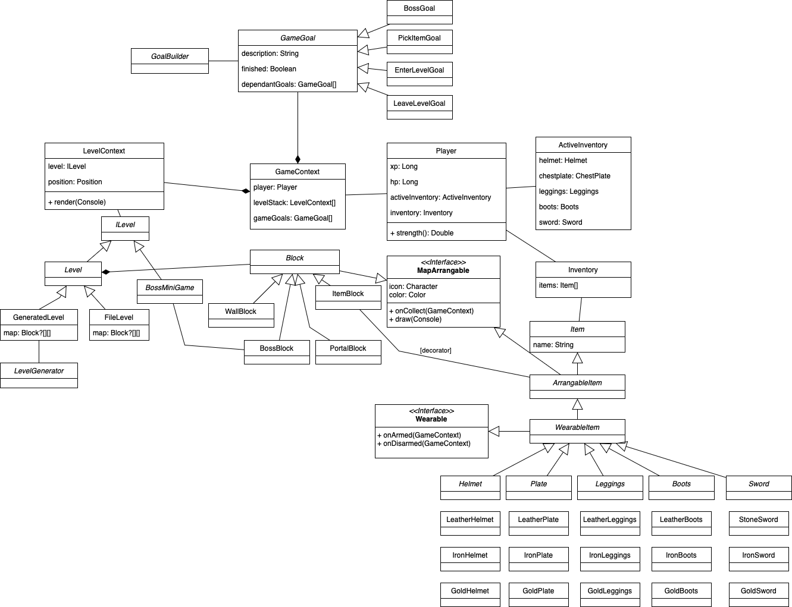

## Roguelike

## Требования к игре

- Игрок перемещается по карте (управление с клавиатуры)
- Карта генерируется, а также подгружается из файла
- Характеристики игрока: здоровье, сила атаки и т.д.
- У игрока есть инвентарь с вещами:
    - можно надеть и снять вещи
    - надетые вещи влияют на характеристики игрока
    - вещи изначально находятся на карте, их можно поднять и добавить в инвентарь
    - снятые вещи продолжают находиться в инвентаре
- Консольная графика

## Общие сведения о системе

Игра представляет консольное приложение на Java, размером консоли 80x24 с управлением с помощью стрелочек и ENTER.

## Architectural drivers

#### Архитектурный стиль

Предлагается воспользоваться слоистой архитектурой aka MVC.

Controller - класс GameController, который отрисовывает поле, принимает UI-события и callback-и на перерисовку.

View - это классы Level и Block (а точнее, все, что реализует интерфейс MapArrangeable)

Model - класс GameContext вместе с GameGoal.

#### О паттернах проектирования

- Для создания различных вещей будет использована ``абстрактная фабрика``
- Блок с вещью будет ``декоратором`` над вещью
- Генератор уровня будет конструироваться с помощью паттерна ``строитель``
- Игровой контекст реализует паттерн ``медиатор``
- Различные блоки карты реализуют паттерн ``команда``
- Блоки получают события о близости игрока к ним – ``наблюдатель``

## Роли и случаи использования

Игрок ходит по карте, соответствующей блокам:
- стена (пройти нельзя)
- предмет (он подбирается)
- босс (с ним происходит отдельное взаимодействие)
- пустой блок (можно тривиально по нему ходить)
- портал 🚪 (перемещает на следующую карту)
- кактус 🌵 (отнимает здоровье)

У игрока есть следующие свойства:
- здоровье ❤️ - int от 0 до 10 (влияет в мини-играх и пр.)
- степень бронированности ♐️ - int от 0 до 10 с шагом 0.5 (влияет в мини-играх)
- опыт 🕶 - double от 0 до inf (влияет на игровые цели и пр.)
- сила 🔱 - double от 1.0 до inf (влияет в мини-играх и пр.)

Предметы бывают следующих типов:
- хилер ❤️ (восстанавливает одно сердечко)
- броня: шлем, нагрудник, штаны, ботинки (кожаные, железные, золотые)
- меч (каменный, железный, золотой)

| бронированность  | Шлем ``^^`` | Нагрудник ``[]`` | Штаны ``/\`` | Ботинки ``db`` |
|---|---|---|---|---|
| отсутствует | 0  | 0  | 0  | 0 |
| Кожа  |  1 | 1  |  1 |  1 |
| Железный  | 1  | 2 |  2 | 1  |
| Золотой  | 2  |  3 |  3  | 2  |

| сила  |  |
|---|---|
| отсутствует  | 1  | 
| Меч 🗡 |  4  | 
| Лук  🏹 | 5  | 
| Пистолет 🔫 | 7 |

Броня, когда надета, увеличивает степень бронированности на константу Меч, когда экипирован, увеличивает силу на константу. Хилер, когда его подбираешь на карте, увеличивает здоровье на сердечко.

Когда здоровье заканчивается, игрок умирает, игра заканчивается.

## Композиция

Диаграмма компонентов

## Логическая структура

Диаграмма классов

## Взаимодействия и состояния

Диаграммы последовательностей и конечных автоматов

